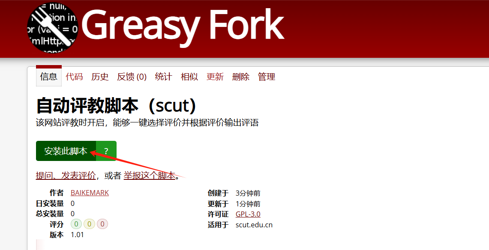
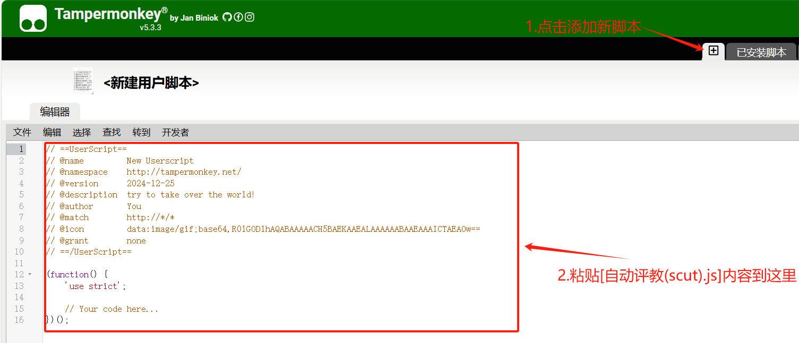

# 自动评教脚本（scut）

## 简介
**自动评教脚本（scut）** 主要在保障教学评价效果的同时提高评价的效率。通过此脚本，用户可以一键选择评价选项、自动填写反馈内容，并快速提交表单。本脚本仅供学习和个人效率提升使用，请勿将其用于任何违反任何规范的用途。

## 温馨提示

 **该脚本的主要目的是对油猴写脚本的简单运用，希望各位同学都能认真评教。本脚本仅供学习和个人效率提升使用，请勿将其用于任何违反任何规范的用途。**

---

## 使用方法

### 1. 安装油猴扩展
- 下载并安装 [Tampermonkey](https://www.tampermonkey.net/) 或其他支持油猴脚本的浏览器扩展。

### 2. 安装脚本
- **方法一**：访问脚本发布平台 [GreasyFork](https://greasyfork.org/)，搜索并下载 **自动评教脚本（scut）** 脚本。
	
	
	
	
- **方法二**：将[自动评教脚本](../自动评教脚本（scut）.js)复制粘贴到 Tampermonkey 插件中添加新脚本。
	 

### 3. 开启脚本
- 确保在 Tampermonkey 的脚本管理页面中启用了脚本。

### 4. 进入目标网页
- 打开并登录 [华南理工大学评价系统](https://pj.jw.scut.edu.cn/) 页面。

### 5. 选择评价并提交
- 页面加载完成后，右上角会出现评价选项和提交按钮。
  - 点击所需的评价选项，脚本会自动完成选项选择和反馈填写。
  - 点击“提交评价”按钮完成表单提交。

---

## 注意事项
1. **兼容性**：脚本仅适用于华南理工大学评价系统，其他页面可能无法正常工作。
2. **加载延迟**：脚本在页面加载完成后才会启动，可能需要等待 1 秒。
3. **自定义功能**：如需调整反馈内容，可以直接修改脚本代码中 `selectAllOptions` 函数的模板部分。
4. **更新提醒**：建议定期在 GreasyFork 检查脚本更新，以确保功能正常使用。
5. **其他问题**：如脚本执行遇到任何问题可以F12打开浏览器控制台查看报错。如首次通过使用**Edge浏览器**使用油猴，可能会提示 **Please enable developer mode to allow userscript injection.** 这时需要打开**Edge浏览器开发人员模式**才能使用

---

## 许可证

该脚本使用 **GPL-3.0 许可证**，详见 [LICENSE](https://opensource.org/licenses/GPL-3.0)。

## 更新记录

### 版本 1.0

- 初始发布，支持一键选择评价选项、自动填写反馈内容，并快速提交表单。

## 联系方式

- 作者：BAIKEMARK
- 如有问题或建议，请在 GitHub 仓库中提交 Issue 或 Pull Request。

## 免责声明

1. 本脚本仅供学习和个人效率提升使用，请勿将其用于任何违反网站规则或法律法规的用途。
2. 用户因使用此脚本造成的任何后果，由用户自行承担。
3. 开发者对脚本的使用效果不作任何保证，且不承担任何相关责任。

**若不同意以上条款，请勿使用本脚本。**
